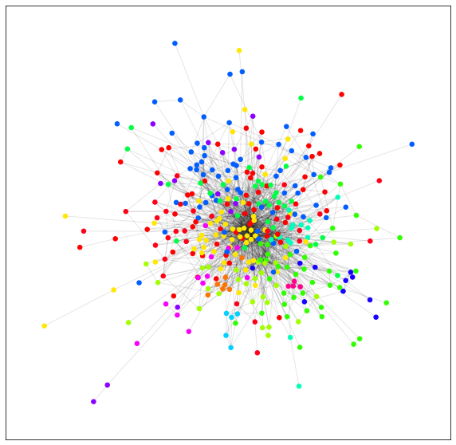

# HashtagNetworks

## Summary:
Twitter contains massive amounts of social data. By analyzing the hashtags people use, we can place users into hashtag communities. After constructing a bipartite network of users and the hashtags they use, we perform a unipartite projection onto the hashtag set, giving us a network of hashtags that are connected if a user used both of them. Then, by using the Louvain Method for community detection, we can find communities of hashtags that are related in some meaningful way.

## Results:
After taking 1.6M tweets from a few-week interval in 2009, we are able to find hashtag networks relating to sports, TV shows, current political events and more. Almost all of the communities detected had some dominant theme, and many revealed hashtags that were not obviously included in the community topic, but upon closer inspection were related, but were obscure. See the [project report](HashtagNetwork.pdf) and [jupyter notebook](HashtagNetworks.ipynb) for more information.
